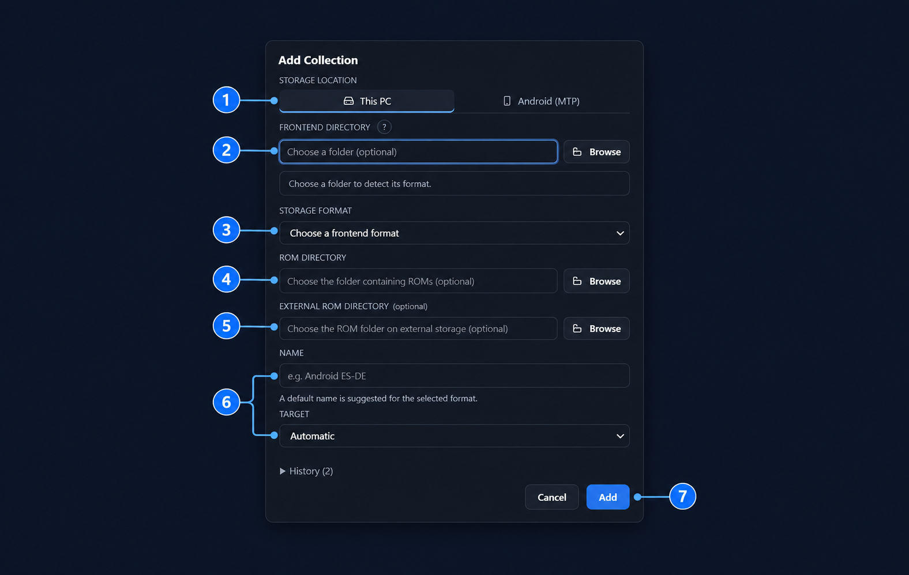
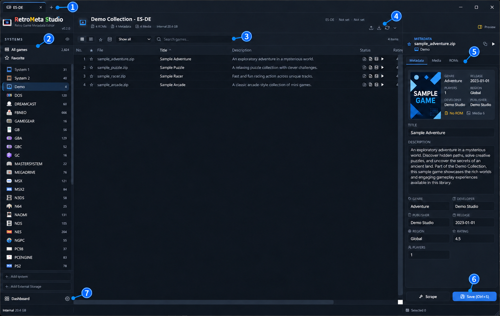
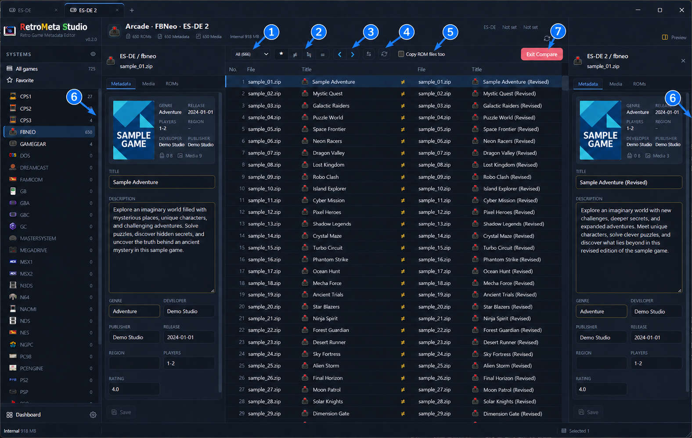
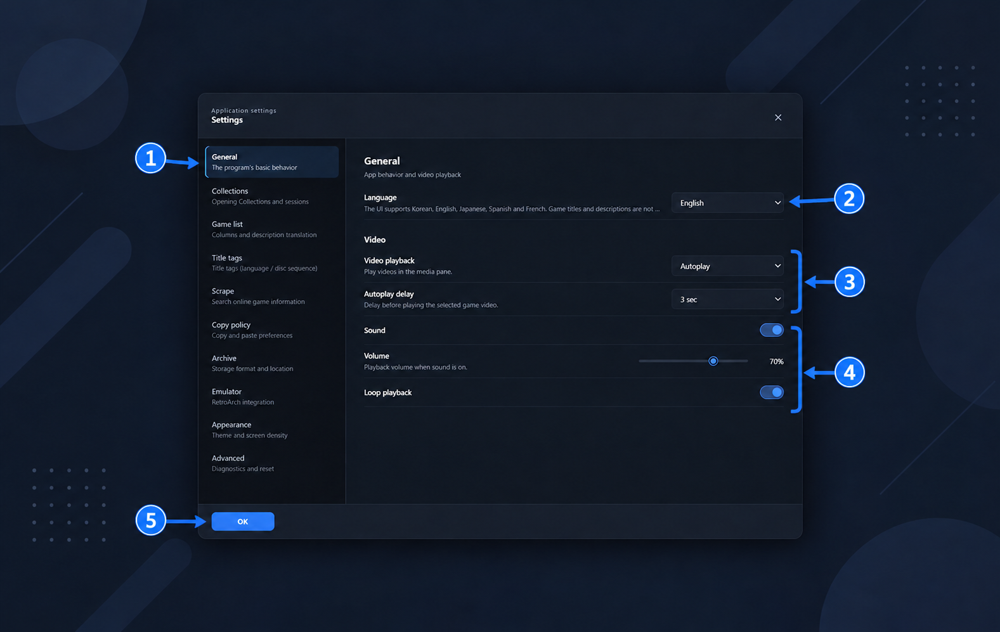

# How to use RetroMeta Studio

Start with one collection on this PC. An Android collection can be managed from the Windows app over MTP; that does not mean the app runs on Android.

## 1. Add your first collection

Click the **+ beside the collection tabs** (① in the main-screen image below). Choose your storage location and the frontend format used by your collection. A collection is a registered library, not a copy of its ROM files.

| Number | Setting | What to choose |
|---|---|---|
| ① | Storage location | **This PC** for local or Windows-accessible storage. **Android (MTP)** for a connected device; enable file transfer and approve access on the device. |
| ② | Frontend Directory | Browse to the folder containing the frontend's collection data. The folder help beside the field describes the expected layout for the selected format. |
| ③ | Storage Format | Confirm the detected format or choose the correct adapter, such as ES-DE. Detection is a suggestion; check it before adding. |
| ④ | ROM Directory | Choose the collection's ROM root when it is separate. At least one metadata or ROM location is required. For Pegasus, the separate ROM field is hidden because metadata normally lives alongside ROMs. |
| ⑤ | External ROM Directory | Optional additional ROM location. Leave it empty for a simple collection without external ROM storage. |
| ⑥ | Name | Use a recognizable name, such as **Demo Library** or **Living-room Library**. If left blank, the app supplies a frontend-based name. |
| ⑥ | Target | Target-platform information describes the collection's intended environment. Leave automatic choices in place unless your collection requires an explicit target. |

Click **Add** (⑦) after checking the format and paths. Registration scans the collection to populate its list. If you change files outside the app, use **Rescan** (④ below) to refresh the view. Folder requirements vary by frontend: do not assume every metadata folder is the same as a ROM root.

The **?** beside Frontend Directory explains the expected folder layout. **Browse** selects a folder. **History** reopens a previously registered collection. Frontend Directory and ROM Directory are individually optional, but at least one must be supplied. Storage Format must be selected.

## 2. Understand the main collection screen

| Number | Area | How to use it |
|---|---|---|
| ① | Collection tabs and **+** | Switch between registered collections; use **+** to add or reopen a collection. |
| ② | Systems navigation | Choose a system to scope the game list, **All games** to see the collection, or **Favorite** for favorites. **Add system** and **Add External Storage** are separate actions; they do not add a new collection. |
| ③ | List controls and search | Switch list/card view, show favorites, prioritize entries with ROMs/metadata/media, and search the current scope. Click column headings to sort. |
| ④ | Collection action icons | Send metadata to Archive, import metadata, rescan files, or expand collection/storage details. See the icon table below. |
| ⑤ | Selected-game details | Select a row to inspect it. **Metadata** shows editable fields; **Media** shows associated assets; **ROMs** shows the relevant ROM entries. **Preview** toggles the preview pane. |
| ⑥ | **Save (Ctrl+S)** | Save edits to the selected game's metadata. Inspect the selected game and fields first; comparing or selecting a row alone does not save edits. |
| ⑦ | Settings gear | Open application settings, including language, appearance, Archive location, copy preferences and other categories. |

| Icon/control | Purpose |
|---|---|
| List / four-square grid | Choose list or card presentation. |
| ☆ / ★ in the toolbar | Toggle favorites-only display. |
| Database icon in the list toolbar | Show collection entries missing from Archive; requires an appropriately configured Archive. |
| **Show all** dropdown | Choose a priority sort (ROM, metadata or media first). It is not a missing-data-only filter. |
| Upward arrow in the collection header | Send collection content to the configured Archive. It is not a generic frontend export button. |
| Downward arrow in the collection header | Open the metadata import source chooser. |
| Circular arrow in the collection header | Rescan the collection/system scope. |
| Down/up chevron in the collection header | Expand/collapse collection details and storage information. |
| **Scrape** | Open scraping controls. Ordinary-account ScreenScraper access is not yet approved or verified in this preview. |

For a first session, add one collection, choose a system, select a game, and inspect the detail tabs before changing any files. Configure Archive only if you want to use its features; it is not required for viewing a collection.

## 3. Compare two collections

Open both collections. Right-click the first collection tab and set it as the comparison base. Right-click the other tab and choose the comparison action naming that base. You can also compare specific systems through their context menus.

The left and right headings identify the two sides. Select a comparison row to inspect both versions in the side panels.

| Number | Control | Purpose |
|---|---|---|
| ① | Comparison dropdown | Show all pairs, differing entries, same entries, one-sided entries, conflicts, or media differences. |
| ② | *** / ≠ / ≒ / =** quick filters | *****: all; **≠**: differing metadata/one-sided results; **≒**: same metadata but different media; **=**: same comparison entries. "Same" does not prove byte-for-byte ROM equality. |
| ③ | **❮ / ❯** direction buttons | Copy the selected entries toward the indicated side. **❮** uses right → left; **❯** uses left → right. Check the source and destination before confirming. |
| ④ | Swap / refresh | Swap the comparison sides or rebuild the comparison from their current state. |
| ⑤ | **Copy ROM files too** | Include ROM files in directional transfers. Leave it off when reconciling metadata/media only. |
| ⑥ | Left and right detail panes | Inspect titles, descriptions, media and ROM details for the selected pair before copying anything. |
| ⑦ | **Exit Compare** | Return to normal collection browsing. |

Begin with comparison and inspection only. If you choose to transfer data, back up the destination, select the intended rows, check direction and the ROM checkbox, then review the operation-specific confirmation. The transfer buttons can change files; there is no standalone Plan review screen in 0.2.0.

## 4. Choose initial application settings

Open the gear (⑦ in the main-screen image), then select **General**.

| Number | Setting | Suggested first-use choice |
|---|---|---|
| ① | Settings categories | Use **General** for language/playback, **Collections** for tab/navigation behavior, and **Appearance** for theme, density and scale. Configure other categories when needed. |
| ② | **Language** | Choose your preferred UI language. English is the default for new users. Game titles and descriptions are not automatically translated. |
| ③ | **Video playback / Autoplay delay** | Choose how preview videos start and the delay before autoplay. The example uses Autoplay and 3 seconds. |
| ④ | **Sound / Volume / Loop playback** | Control preview audio, its level, and whether videos repeat. These settings concern media previews. |
| ⑤ | **OK** | Finish saving pending settings changes and close the dialog. Settings are updated through their controls; this button does not save game metadata. |

For a quieter first session, turn preview sound off. If the interface feels crowded, use **Appearance** to adjust scale and density. ScreenScraper settings are for the integration under development; do not enter developer credentials copied from another application.

## Data, updates, and removal

In this preview, settings and databases are stored in `db`, logs in `logs`, and clipboard handoff files in `clipboard`, beside the executable. ROMs, media, and Archive files may be stored at separately configured locations.

Back up application databases and any affected collection files before making changes. To update, close the app, extract the new release into a separate folder, and migrate your backed-up application data only when the release notes confirm compatibility. Do not overwrite or remove your only copy of user data. An older app may not be able to open a database migrated by a newer version.

To remove the preview, close it and remove the extracted application folder after preserving any data you need. Check separately configured Archive and collection locations before deleting anything.

## About the images

These are AI-edited guide illustrations based on actual 0.2.0 screenshots. Commercial game artwork and copied descriptions were replaced with fictional sample content; some backgrounds and icons are also edited. The numbered circles are documentation overlays, not application controls. Minor visual details may differ. The images do not demonstrate approved ScreenScraper access.

[Back to the project overview](README.md) · [Ask a question](https://github.com/moning-1664/retro-meta-studio-releases/discussions/categories/q-a)
