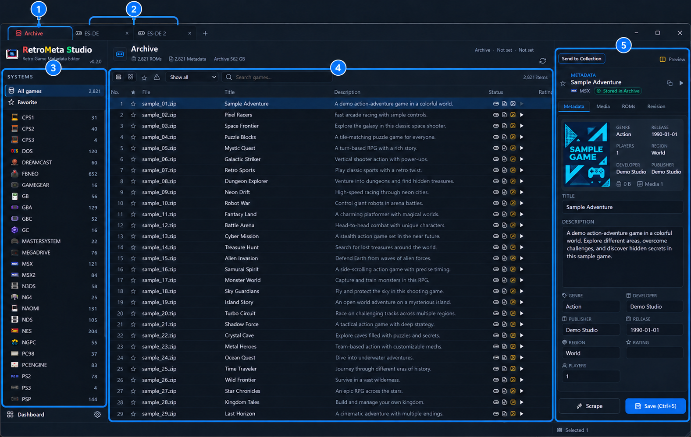

# RetroMeta Studio

**README** | [How to Use](HOW_TO_USE.md) | [Release Notes](RELEASE_NOTES.md)

**English** · [한국어](README.ko.md)

A free Windows desktop app for organizing game collections, metadata, and media across frontend formats.

**First public preview: 0.2.0 · Windows x64 · English by default**

[Download version 0.2.0](https://github.com/moning-1664/retro-meta-studio-releases/releases/tag/v0.2.0) · [Ask a question](https://github.com/moning-1664/retro-meta-studio-releases/discussions/categories/q-a)

RetroMeta Studio brings your game libraries into one workspace. Browse games, edit metadata and media associations, and compare frontend collections to reconcile their differences. Adapters support ES-DE, EmulationStation, Pegasus, and LaunchBox; compatibility varies by format and configuration.

## Quick Start

1. Download and extract the entire release ZIP, then run `RetroMetaStudio.exe`. Python is not required.
2. Click **+** beside the tabs to add a collection. Choose its frontend format and folders.
3. Choose a system, select a game, and inspect its details. Back up existing files before editing or transferring data.
4. Configure **Settings → Archive** if you want to retain selected data and revision history.

| Area | Purpose |
|---|---|
| ① **Archive tab** | Browse selected games, metadata, media and revision history retained in the optional Archive. It does not automatically back up every collection. |
| ② **Collection tabs** | Switch between registered libraries. A Collection links a frontend format to its ROM, metadata and media locations; registration does not duplicate the library. |
| ③ **SYSTEMS** | Choose a system, all games or favorites to narrow the current library view. |
| ④ **Gamelist** | Browse, search and sort games in the active Archive or Collection. |
| ⑤ **Detail** | Inspect and edit the selected game's metadata, media and ROM information. Archive entries also offer revision history. |

## How to Use

See [**How to Use**](HOW_TO_USE.md) for collection setup, Archive workflows, comparison controls and application settings.

## ScreenScraper integration status

ScreenScraper integration is under development. Developer API authorization is being prepared; this release does **not** claim approval by ScreenScraper or verified access for ordinary user accounts. An ordinary ScreenScraper account alone is not sufficient to configure this preview. Public account-based scraping will be validated after developer authorization.

Do not post developer credentials, account passwords, or authenticated request URLs in public discussions.

## Download and run

1. Download `RetroMetaStudio-0.2.0-windows-x64.zip` from the release page, rather than GitHub's automatically generated source archives.
2. Extract the **entire** ZIP into a writable folder, such as a folder under your user profile. Avoid `Program Files` for this preview.
3. Keep `RetroMetaStudio.exe` and `_internal` together. Run `RetroMetaStudio.exe` from the extracted folder.
4. If the app cannot initialize its web interface, install the [Microsoft Evergreen WebView2 Runtime](https://developer.microsoft.com/en-us/microsoft-edge/webview2/).

Python installation is not required. This preview has no installer or automatic update checker. English is the initial UI language; existing saved preferences take precedence. The UI also supports Korean, Japanese, Spanish, and French. Changing UI language does not translate existing game data.

## Questions and reports

Use [GitHub Q&A](https://github.com/moning-1664/retro-meta-studio-releases/discussions/categories/q-a). Include the app version, Windows version, steps to reproduce, and expected versus actual behavior. For troubleshooting, attach relevant portions of `logs/retrometa.log` as a `.log` or `.txt` file.

Discussions are public. Review logs before uploading: remove passwords, tokens, usernames, personal paths, and sensitive filenames. Automatic diagnostic log sanitization is planned and is not available in this release.

## Free use and responsibility

RetroMeta Studio is provided free of charge for lawful use. Users are responsible for ensuring they have the necessary rights to any ROMs, BIOS files, metadata, images, and other content they process, and for complying with applicable law and third-party service terms. No ROMs, BIOS files, or commercial game artwork are supplied as collection content.

The software is provided as-is. To the extent permitted by applicable law, no warranty of accuracy, fitness for a particular purpose, or uninterrupted operation is given, and the provider's liability is limited to the extent permitted by law. These terms do not exclude liability for intentional misconduct, gross negligence, or any liability that cannot legally be excluded. Review file operations and maintain backups.

Free use does not grant a license to the private source code. Third-party components remain subject to their own license terms; see the notices included with the download. Product and service names identify compatible formats and integrations and do not imply affiliation, sponsorship, or endorsement.

## Preview limitations and next steps

This release is an early preview for evaluation and developer API review. Windows only; no Linux or macOS build is provided. Clean-machine compatibility and all frontend variants have not yet been comprehensively validated.

Planned next steps: approved ScreenScraper integration using each user's own account, GitHub release update notifications, and a Windows installation wizard with safe user-data migration.
