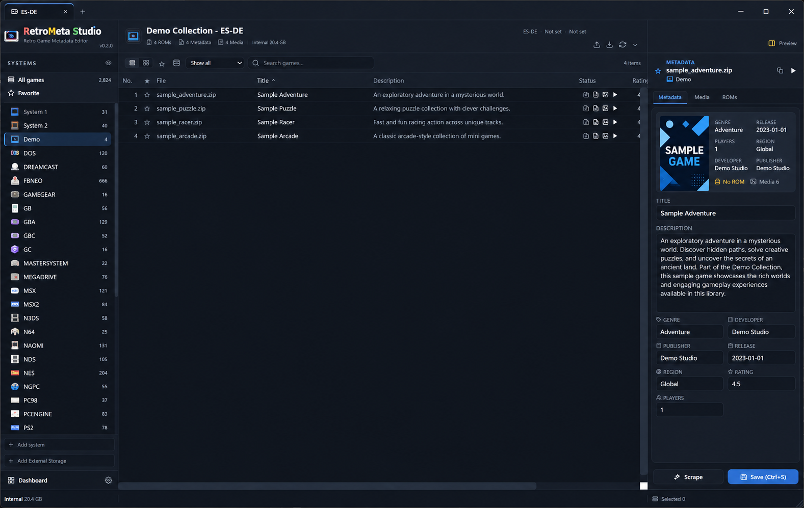

# RetroMeta Studio

A free Windows desktop app for organizing game collections, metadata, and media across frontend formats.

**First public preview: 0.2.0 · Windows x64 · English by default**

[Download version 0.2.0](https://github.com/moning-1664/retro-meta-studio-releases/releases/tag/v0.2.0) · [How to use](HOW_TO_USE.md) · [Ask a question](https://github.com/moning-1664/retro-meta-studio-releases/discussions/categories/q-a)

## What you can do

- Register and scan collections on storage accessible from Windows.
- Review and edit game metadata and media associations.
- Compare collections side by side and inspect metadata differences.
- Read and write frontend formats through adapters for ES-DE, EmulationStation, Pegasus, and LaunchBox. Compatibility varies by format and configuration; back up existing frontend files first.
- Configure an optional Archive to retain selected collection data and revision history.

## Collection and Archive

A **Collection** is a library registered in RetroMeta Studio: its frontend format, ROM locations, metadata and media. You can register several collections and switch between their tabs. Adding a collection points the app to existing locations; it does not duplicate the library.

An **Archive** is an optional place to collect selected games, metadata and media and keep revision history. It can help preserve and reconcile information from different collections. Choose its location in Settings when you need it; you can browse and edit collections without configuring an Archive. It does not automatically back up every registered collection.

## ScreenScraper integration status

ScreenScraper integration is under development. Developer API authorization is being prepared; this release does **not** claim approval by ScreenScraper or verified access for ordinary user accounts. An ordinary ScreenScraper account alone is not sufficient to configure this preview. Public account-based scraping will be validated after developer authorization.

Do not post developer credentials, account passwords, or authenticated request URLs in public discussions.

## Download and run

1. Download `RetroMetaStudio-0.2.0-windows-x64.zip` from the release page, rather than GitHub's automatically generated source archives.
2. Extract the **entire** ZIP into a writable folder, such as a folder under your user profile. Avoid `Program Files` for this preview.
3. Keep `RetroMetaStudio.exe` and `_internal` together. Run `RetroMetaStudio.exe` from the extracted folder.
4. If the app cannot initialize its web interface, install the [Microsoft Evergreen WebView2 Runtime](https://developer.microsoft.com/en-us/microsoft-edge/webview2/).

Python installation is not required. This preview has no installer or automatic update checker. English is the initial UI language; existing saved preferences take precedence. The UI also supports Korean, Japanese, Spanish, and French. Changing UI language does not translate existing game data.

## Quick start

1. Click **+** beside the collection tabs and choose the frontend format and collection folders.
2. Select a system and a game to inspect its metadata and media.
3. Edit the required fields and use **Save (Ctrl+S)**. Back up files before making changes.

[**How to use — numbered screen guide**](HOW_TO_USE.md) covers Add Collection, the main screen, comparison controls and initial settings.

*Edited demo image based on a real 0.2.0 capture; commercial game content has been replaced.*

## Questions and reports

Use [GitHub Q&A](https://github.com/moning-1664/retro-meta-studio-releases/discussions/categories/q-a). Include the app version, Windows version, steps to reproduce, and expected versus actual behavior. For troubleshooting, attach relevant portions of `logs/retrometa.log` as a `.log` or `.txt` file.

Discussions are public. Review logs before uploading: remove passwords, tokens, usernames, personal paths, and sensitive filenames. Automatic diagnostic log sanitization is planned and is not available in this release.

## Free use and responsibility

RetroMeta Studio is provided free of charge for lawful use. Users are responsible for ensuring they have the necessary rights to any ROMs, BIOS files, metadata, images, and other content they process, and for complying with applicable law and third-party service terms. No ROMs, BIOS files, or commercial game artwork are supplied as collection content.

The software is provided as-is. To the extent permitted by applicable law, no warranty of accuracy, fitness for a particular purpose, or uninterrupted operation is given, and the provider's liability is limited to the extent permitted by law. These terms do not exclude liability for intentional misconduct, gross negligence, or any liability that cannot legally be excluded. Review file operations and maintain backups.

Free use does not grant a license to the private source code. Third-party components remain subject to their own license terms; see the notices included with the download. Product and service names identify compatible formats and integrations and do not imply affiliation, sponsorship, or endorsement.

## Preview limitations and next steps

This release is an early preview for evaluation and developer API review. Windows only; no Linux or macOS build is provided. Clean-machine compatibility and all frontend variants have not yet been comprehensively validated.

Planned next steps: approved ScreenScraper integration using each user's own account, GitHub release update notifications, and a Windows installation wizard with safe user-data migration.

## About the images

These are **AI-edited demonstration images based on actual 0.2.0 screenshots**, not unmodified captures. Commercial game artwork and copied descriptions have been replaced with fictional sample content; some backgrounds and icons are also edited. Numbered callouts are documentation overlays and are not application controls. Minor visual details may differ from the running app. These images do not demonstrate approved ScreenScraper access.
